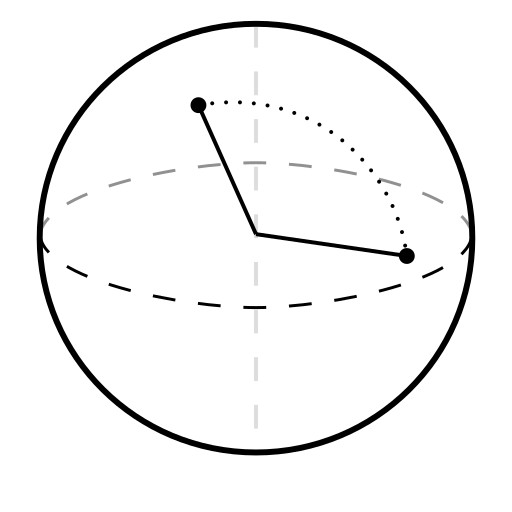
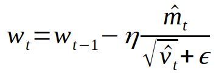

<h1 align="center">
  SUMO
</h1>

<h3 align="center">
    u<b>S</b>er g<b>U</b>ided e<b>M</b>bedding <b>O</b>ptimizer
</h3>

## Preface
This was a bit of an experiement that worked ok-ish, enough for me to share it. The main goal was to create an "offline" social media using text-to-image generators, which was made possible after the creation of SDXL-Turbo. If creating images as fast as the user can scroll is now feasable, then what about creating images that they **want** to see? I hope to show that this is indeed possible in the embedding space.

TLDR - When a user views an image for longer, the more the features of the image are saved and emphasised for the next generated image.

## Results

For the following images, the model and seed is the same. The only difference is that the prompt has been "enhanced" by the embedding that was optimised by my application after viewing around ~dozen images. 

| Original  |  After Augmentation  |
| --- | --- |
|  |  |
|  |  |
|  |  |

From personal experience, I tend to select images that look more detailed and futuristic, but the generated content varies wildly depending on how conscience I am about the time I spend on each image.

I've also witnessed structural changes, such as adding a subject like cars, robots, or landscapes.

## How it works
### Embeddings

There are quite a few forms of embeddings in the ml world. For the sake of argument, we can image an embedding as any possible concept in the form of a vector, which also manages to capture the same relationshops. Eg: Adult + (Cat - Kitten) = Baby

In the case of SDXL-Turbo, embeddings are generated from the input text and fed into a text-to-image model to produce an image, such that the image has a similar embedding to the given input.

### The End Goal

I want a scollable format in which the user is presented with a series of images. Each image is shown one at a time. My main assumption is that if an image is more favourable to the user, then they will spend a longer time looking at it. Thus, our end goal is to maximise the time spent looking at future generated images, given this minimal information provided.

### The Key Insight
 
To acheive the end goal, we need to identify features that the user is interested in. One way to do this is by directly comparing two embeddings and their associated "scores" (time spent viewing). The difference in the embeddings can be assumed to be the "reason" in which the chosen embedding was selected. In other words, if the worser embedding contained more of this "reason" embedding, then it would've likely have a higher chance of the user doing viewing it for longer and giving it a larger score.

#### Gradient Descent

This "reason" embedding can be thought of as "nudging a ball" towards the "target location" (whatever the user wants to see), where the amount of nudging should thus decrease at the most optimial position. This is a classic problem for gradient descent to solve. In my case, I use the "Adam" optimizer to control the velocity and momentum of the "ball", such that these nudges are able to smooth themselves out to remove noise, as well as exploiting features to minimise the total number of steps taken.  

It is then as simple as interpolating a random prompt to this calculated position to show the user the identified features, and to then continue the cycle.

### Possible applications

One possible application might be in conjunction with a vector database. Instead of generating content (like in this case), the same technique can be used to identify the target embedding and fetch the nearest **existing** content. This might be useful for social media platforms to enhance user recommendations, or to identify "missing" content that a majority of people may wish to view, but that currently does not exist.

While this technique may not be optimal in comparison to "collaborative" recommendations, It should work great in scenarios where the content is really niche, new, or has a very small audience.

 
Thanks for checking out my work, as always, hope it helps out with whatever you're doing!